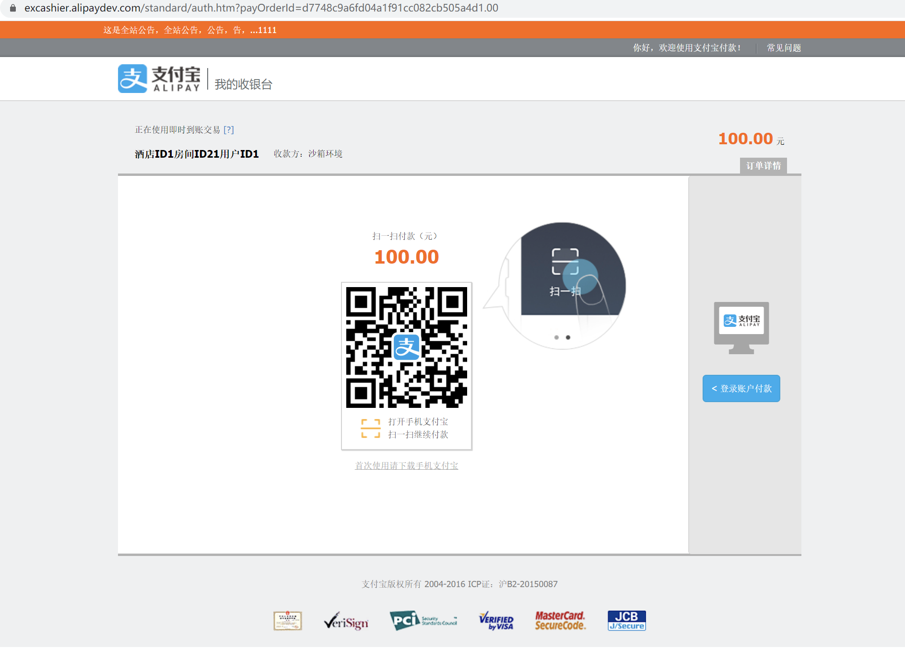
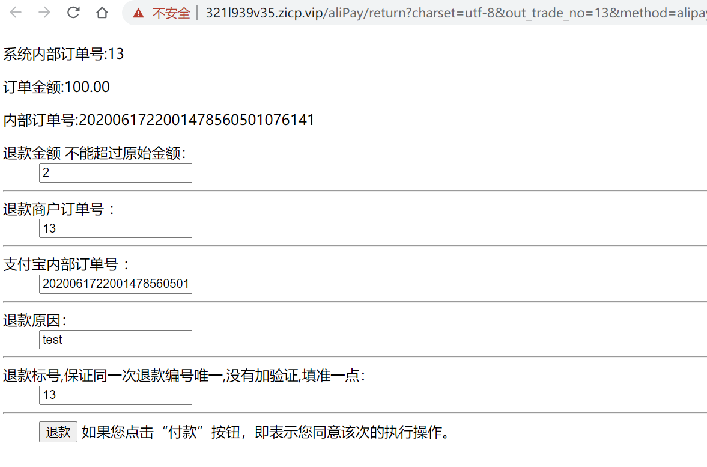

## 说明文档
#### 支付宝支付模块
提交者:何成阳
功能说明: 对接支付宝沙箱环境,支持查询,支付,退款
暂不支持的功能: 并发,多线程,锁机制

##### 接口

**AlipayController**

包名: ***com.demo.springboot.helloworld.controller.AliPayController***

| 功能                 | 接口名称         | 接管的请求       |
| -------------------- | ---------------- | ---------------- |
| 支付成功返回界面     | return_message() | 供支付宝使用     |
| 向支付宝发送退款请求 | refund()         | "/aliPay/refund" |
| 异步验证             | notify_message() | 供支付宝使用     |
| 向支付宝发起支付请求 | pay()            | "/aliPay/goPay"  |

------------------------

**AlipayConfig**

配置对接支付宝的相关信息,代码内包含具体注释

包名:***com.demo.springboot.helloworld.config.AlipayConfig***

---------------------

**application.yml**

包含了邮箱的配置以及数据库版本

> 数据库版本较高,请手动修改或覆盖

##### 注意事项

- 支付宝要求"***return_url***  和***notify_url*** 必须是公网可访问的
- 如过本地IP处于局域网环境/没有内网映射/没有公网IP, **接口不能调用成功**
- 数据库暂时使用的自己的,没来的及合并
- 填写demo参数时,参数需合法
- demo请访问 ***localhost:8585/pay.html***

##### 测试截图

